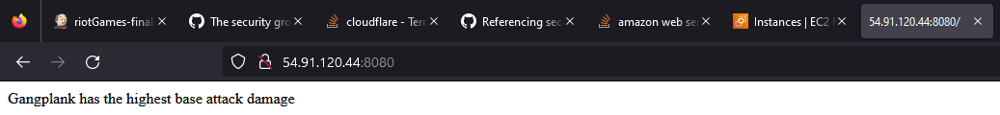
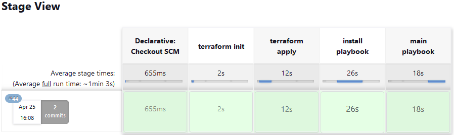

<h1> /riotGames </h1>

<h2> A project incorporating many DevOps tools and practices: </h2>

- <h3> Containerisation with:  </h3>

- <h3> Infrastructure as Code with:  </h3>

- <h3> Continous Integration/Delivery with:  </h3>

- <h3> Configuration Management with:  </h3>

- <h3> Infrastructure:  </h3>

 <h2>Short Description: </h2>

This project deploys a simple flask application on a AWS EC2 instance, which was created with Terraform and provisioned with Ansible, all of this was done through a Jenkins CICD pipeline. This repositories master branch is the final product, but also includes other branches that were used for throughout different stages of this project.

This application retrieves information from the <b>RiotGames</b> API, slightly manipulates it and does a simple comparison. The end result, printing an appropriate message for the character with the highest number for a given stat.

~~~
[NAME] has the highest base attack damage
~~~

 <h1>Branches</h1>

<h2>docker-images</h2>

This branch was all about turning the python scripts I had, that serve as the main functionality for the contents of this project, was containerised. A very simple Dockerfile and respective requirement.txt.

<h2>terraform</h2>

This branch introduced three things: Infrastructure as Code with Terraform, a slight code refactor and a Jenkins pipeline. The main.tf defines a security group as well as an EC2 instance, allowing SSH which will later be used by Ansible in addition to HTTP 80 and 8080 that is defined in the flask app.

<h2>ec2-setup</h2>

This branch introduced configuration management with Ansible, it used a non-Terraform EC2 instance to reduce complexity slightly. Installing many of the needed software manually, focusing on actual execution of the application

<h2>ec2-final-steps</h2>

The final branch - refactoring to two ansible playbooks, one for installation and another for running the application. In addition to introducing nginx which is run in a Docker container and so a docker-compose.yml was added as the final piece.

 <h1>Images</h1>
<h2>AWS EC2 Endpoint<h2>

 <h2>Jenkins Pipeline Build<h2>
